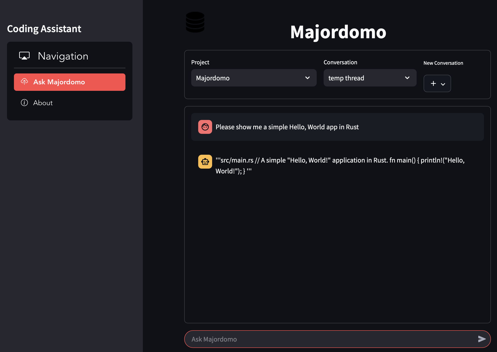

# Majordomo - Code generation Bot
*Created by M. Massenzio &copy; 2023-2025 AlertAvert.com All Rights Reserved*

[](https://github.com/alertavert/majordomo/actions/workflows/test.yml)


# Majordomo API

## Build & run Server

`make help` shows all the available commands.

`make build` and `make test` do what one expects they would, the server is built in the `build/bin` folder, and tagged with the current `version` (derived from the `settings.yaml` and the current git SHA).

Run a development instance using `make dev`, the server is available at `http://localhost:5000`.

## Docker & Kubernetes

The container can be created with `make container` the image name and version are determined automatically (the version will match what is in [`settings.yaml`](settings.yaml)), something like:

    alertavert/majordomo:0.6.1

and can be run via the `make start` command.

To deploy the container to a Kind cluster running locally, run the following commands:

```shell
kind create cluster --name dev
kind --name=dev load docker-image alertavert/majordomo:0.6.1
kubectl create ns majo
kubectl create -n majo configmap majordomo-config --from-file=$HOME/.majordomo/config.yaml
kubectl apply -f deploy.yaml
```

The service is then accessible from within the cluster at:

    http://majordomo-service.majo.svc.cluster.local

## API

`TODO`

These are currently the endpoints:

```
GET    /health
POST   /command
POST   /parse
POST   /prompt
GET    /projects
GET    /projects/:project_name
GET    /projects/:project_name/sessions
POST   /projects
PUT    /projects
PUT    /projects/:project_name
DELETE /projects/:project_name
GET    /assistants
```

Load [the Postman collection](docs/Majordomo.postman_collection.json) into [Postman]() to see example API calls and the format of the JSON body.

## OpenAI Interface

`TODO`

## Backend Architecture

`TODO`

# Majordomo UI

The web app is created using [Streamlit](https://streamlit.io) and is in the [`webapp`](webapp) folder.



and can be run using:

    streamlit run webapp/app.py debug

`streamlit` needs to be installed in a virtualenv using `pip install streamlit`.